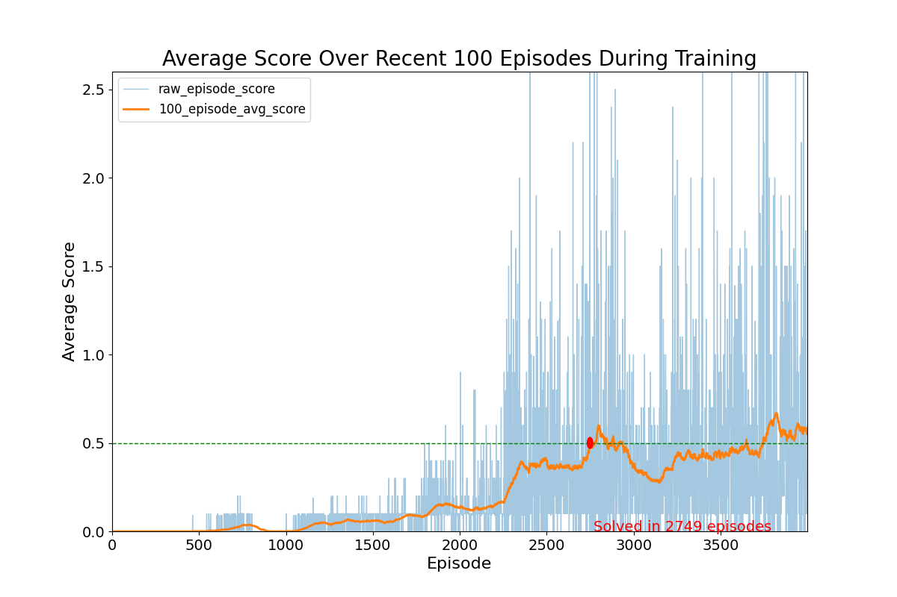

# Multi-Agent RL - Tennis in Unity-ML

Project code for solving a multi-agent learning problem, specifically solving the Tennis environment by training multiple agents to play a two-player game of tennis in Unity-ML.
Part of my work for the Deep RL Nanodegree on Udacity.

## Author

Chris Cadonic

chriscadonic@gmail.com

## Background

**
A full report describing much of my approach, results, and potential improvements can be found in the file [docs/Report.pdf](docs/Report.pdf).**

In this project, a Unity environment that simulates a table tennis match between two agents aims to probe whether one can use a multi-agent RL algorithm to train the agents to play together and keep up a decent rally.
Specifically, the two agents are each given a racket and are tasked with moving the rackets about such that they bounce back and forth an orange ball for as long as possible.

The environment presents the following MDP for us to solve:

* *observations (states)*: states are presented to each agent as a continuous valued 8-vector that contains information about position and velocity of the racket and the ball,
* *actions*: actions are presented to provided by each agent as a continuously valued 2-vector that contains the amount of horizontal movement to apply to the racket and how much vertical jump to apply,
* *rewards*: rewards are provided as +0.1 if the agent successfully hits the ball over the net to the other agent, and gets a -0.01 if the ball hits the ground on their side of the table or they hit it out of bounds.

With these characteristics, each agent can learn how to move appropriately so as to reliably hit the ball over the net before it hits their side of the table, all while not hitting the ball too far and having it go out of bounds. Thus, the agent must learn how to adapt from the observation space of the ball and its current location to know how to move towards the ball at the right moment to hit it back to the other agent.
Scoring how well the agents are achieving this is done by taking the *maximum* accumulated reward by either agent in an episode, and that defines the episode score. The goal of the agents is to *achieve a 100-episode average score of +0.5*.

A quick example demonstration of the game being played prior to training is shown below, where one agent is controlling the blue racket and the other agent is controlling the red racket:


Contrast this to agents that are now knowledgeable about how to play and can keep the ball in play much better:


Again, reaching this point means that the agents have achieved the goal of a 100-episode average score of +0.5.

## Setup and Running

### Setup

Just as in outlined in [the DRLND repository](https://github.com/udacity/deep-reinforcement-learning#dependencies), the following steps can be used to setup the environment:

1. Setup an `anaconda` environment (optional):
```
conda create --name drlnd python=3.6
```
and then activate this environment using:
```
conda activate drlnd
```
in MacOS and Linux or
```
activate drlnd
```
in Windows.

2. As in the DRLND repository, install dependencies using:
```
git clone https://github.com/udacity/deep-reinforcement-learning.git
cd deep-reinforcement-learning/python
pip install .
```

3. Setup the Unity environment

This environment is specifically provided by Udacity to contain the learning environment.

Environments can be downloaded from here:
* Linux: [here](https://s3-us-west-1.amazonaws.com/udacity-drlnd/P3/Tennis/Tennis_Linux.zip)
* Mac OSX: [here](https://s3-us-west-1.amazonaws.com/udacity-drlnd/P3/Tennis/Tennis.app.zip)
* Windows (32-bit): [here](https://s3-us-west-1.amazonaws.com/udacity-drlnd/P3/Tennis/Tennis_Windows_x86.zip)
* Windows (64-bit): [here](https://s3-us-west-1.amazonaws.com/udacity-drlnd/P3/Tennis/Tennis_Windows_x86_64.zip)
* Linux (no visualization): [here](https://s3-us-west-1.amazonaws.com/udacity-drlnd/P3/Tennis/Tennis_Linux_NoVis.zip)

With the Unity environment acquired, the directory structure for this project should then be:

```
configs/...
docs/...
envs/...  <-- place the unzipped Unity environment directories here
models/...
tennis/...  <-- main code for project
output/...
README.md
runner.py
requirements.txt
```
Main code in the `tennis` directory is organized as follows:
```
tennis/
    agents/
        agent.py             <-- base code for running an agent (defaults behaviour is a random agent)
        d4pg_agent.py        <-- code for running the D4PG algorithm
        ddpg_agent.py        <-- code for running the DDPG algorithm
        ppo_agent.py         <-- code for running the PPO algorithm
    tennis_main.py           <-- code for interfacing the agents and the environment
                                  and running episodes in the environment
    torch_models/
        simple_linear.py     <-- torch model for DDPG using a set of linearly connected layers
```

### Running

```
python runner.py
```
from the root of this project repository. Arguments can be provided as follows:
- `-t` (or `--train`): train the model with the provided configuration file (Defaults to False),
- `-c` (or `--config`): specify the configuration to use for training the model (Defaults to `configs/default_config.yaml`.

Thus, running the model to show inference using the final trained model without visualization can be run using:
```
python runner.py
```
or with visualization using:
```
python runner.py -c configs/default_vis_config.yaml
```

The model can also be retrained if one wishes by passing the `-t` or `--train` flag. Be careful as this will overwrite any output in the `output/` directory and saved models in the `models` directory, as specified by the configuration file.

If one wishes to change parameters, then you can create a new configuration file, or modify an existing configuration file, and provide parameters in the following format:
```
# general parameters
file_path: 'envs/Tennis_Linux_Vis/Tennis.x86_64'
# file_path: 'envs/Reacher_Single.app'
model_file: 'models/final_maddpg.pkl'
graph_file: 'training_performance_final.png'

###########################################################################
# valid values include 'random', 'ddpg'
alg: 'maddpg'
###########################################################################

# parameters for printing and controlling learning time
frame_time: 0.00
max_episodes: 4000
max_iterations: 5000
t_update: 2  # number of time steps to take before update
num_updates: 5 # number of network updates to complete in a time step

# model parameters
model_params:
  # training parameters
  gamma: 0.99
  actor_alpha: 0.0001
  critic_alpha: 0.0003
  t_freq: 100
  tau: 0.001

  # parameters for the Ornstein-Uhlenbeck noise process
  use_ornstein: True
  theta: 0.15
  sigma: 0.2
  mu: 0.0
  decay: 1.0
  # general noise characteristics
  epsilon: 1.0
  epsilon_decay: 1.0
  epsilon_min: 1.0
  noise_variance: 0.5

  # parameters for the replay buffer
  buffer_size: 1000000
  batch_size: 256

  # architecture
  inter_dims: [256, 256]
  use_batch_norm: True

  # parameters specific to PPO
  eps_clip: 0.05
  variance_decay: 0.9995
```

## Results

Using the MADDPG algorithm [first proposed by Lowe et al.](https://arxiv.org/pdf/1706.02275.pdf), agents were able to learn how to successfully coordinate and move the rackets to successfully keep the ball in play.

The actor-critic algorithm employs centralized critics and local (agent-specific) actors that implement the following architectures:


With this architectural setup, the following parameters were determined through manual optimization search or by adapting noise process values from the DDPG paper [paper by Lillicrap at al.](https://arxiv.org/abs/1509.02971), specifically regarding parameters for the Ornstein-Uhlenbeck noise process.

| Hyperparameter | utility | value |
| --- | --- | --- |
| $\alpha_{actor}$ | learning rate | 0.0001 |
| $\alpha_{critic}$ | learning rate | 0.0003 |
| $\tau$ | target network soft-update rate | 0.001 |
| $\gamma$ | discount factor on future returns | 0.99 |
| $t\ update$ | number of steps to take before updating networks | 2 |
| $num updates$ | number of updates to complete each time networks are updated during training | 5 |
| $\mu$ | regression mean for Ornstein-Uhlenbeck noise | 0.0 |
| $\theta$ | factor for weighing the delta of value from mean | 0.15 |
| $\sigma$ | factor for weighting the Weiner (Gaussian) noise process | 0.2 |

With these values, the following results were acquired:



This illustrates that the agents were able to start learning to effectively keep the ball in play and reach a decently stable 100-episode average episode score of +0.5 after 3088 iterations.
Episode score here again reflecting the maximum score between the two agents playing tennis, each training individually.

These results show that training resulted in slow increases in performance until the agents started to accumulate positively rewarding observation/action patterns in the replay buffer, which helped both agents to rapidly learn how to control their rackets effectively.
Towards the end of training, however, it also appeared that there was some issues with stability and variance around the goal average score of +0.5, which may be indicative of deviation of the critic and/or actor loss functions due to a change in the types of rewards observed for each episode.
This mainly suggests that the rapid change in variability in the rewards received may affect the learning process for the agents.

To observe more improvement with this algorithm, it may be useful to further explore modifications to the nature of the Ornstein-Uhlenbeck noise, such as parameter experimentation and/or decaying, or possibly exploring other types of noise such as Gaussian noise.
Furthermore, incorporating prioritied experience replay may also have proved useful given the possible influence of the types of experiences sampled from the buffer affecting training stability as mentioned previously. Lastly, more rigorous hyperparameter tuning, architecture experimentation, and implementation of other comparison algorithms such as [EAQR](https://downloads.hindawi.com/journals/complexity/2018/7172614.pdf).
